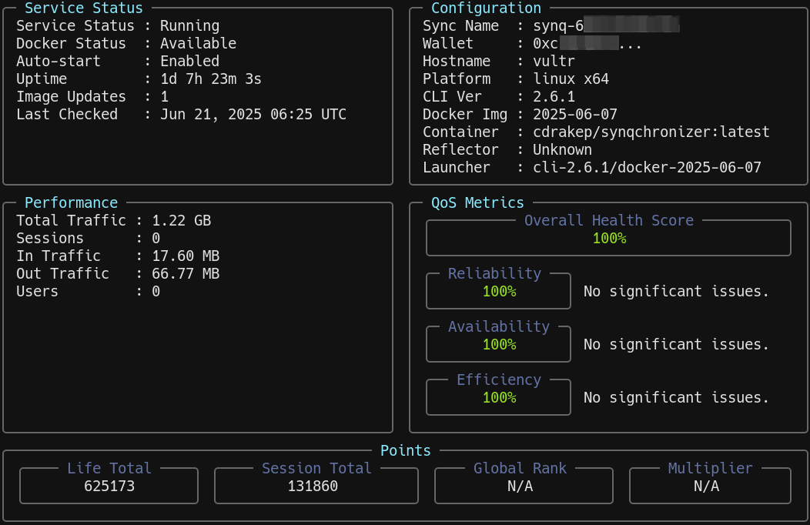

## Description
A Multisynq TUI (Text User Interface) dashboard that displays and monitors [Multisynq synchronizer-cli](https://github.com/multisynq/synchronizer-cli) server's metrics, QoS.<br/>
[Textual framework for python](https://textual.textualize.io/) is used for most of the heavy lifting.<br/><br/>
- Most of the data is pulled via API endpoints as outlined in the [official Multisynq synchronize-cli API reference](https://github.com/multisynq/synchronizer-cli?tab=readme-ov-file#dashboard-api-port-3000).<br/>
- Data is refreshed at predefined intervals: 5 - 10 seconds<br/>



## Features
- values auto-refresh 
- auto-resizable widgets with terminal resize 
- color themes
- more to come


## Disclaimer
This is a work in progress-hobby project. Errors, bugs are expected.<br/><br/>

## Requirements
- Linux OS
- Tested with python3.11/12/13

  
## Installation

1) Create python virtual environment
```
 python3 -m venv dashboard
```
<br/>

2) Install dependencies
```
 pip install requests textual httpx rich
```
<br/>

3) (**OPTIONAL**) if connecting to a remote server<br/>

&nbsp;&nbsp;&nbsp;&nbsp;&nbsp;&nbsp;Copy `/home/username/.synchronizer-cli/config.json` from remote server,<br/>
&nbsp;&nbsp;&nbsp;&nbsp;&nbsp;&nbsp;to your local computer and place in `~/.synchronizer-cli/config.json`
<br/>
&nbsp;&nbsp;&nbsp;&nbsp;&nbsp;&nbsp;**NOTE**: this silly logic will be changed/fixed shortly<br/>
&nbsp;&nbsp;&nbsp;&nbsp;&nbsp;&nbsp;**TIP**: If connecting to a server outside of your LAN, consider using **SSH Local Port Forwarding** to secure connection, instead of opening ports
```
ssh -N -L 3000:localhost:3000 user@remote-server
```
<br/>

## Usage/Examples

> Activate virtual environment
```
cd dashboard
. bin/python3
```
<br/>

> View TUI dashboard for locally operated synchronizer server (http://localhost:3000)

Sync name, key, wallet information is pulled from the synchronizer-cli config file (/home/username/.synchronizer-cli/config.json)<br/>
```
./dashboard.py
```
<br/>

> View TUI dashboard for remotely operated synchronizer server (http://x.x.x.x:3000)
```
./dashboard.py --server 'http://x.x.x.x:3000'
```

<br/>

## References
- [Multisynq synchronizer-cli](https://github.com/multisynq/synchronizer-cli)
- [Textual](https://textual.textualize.io/)
